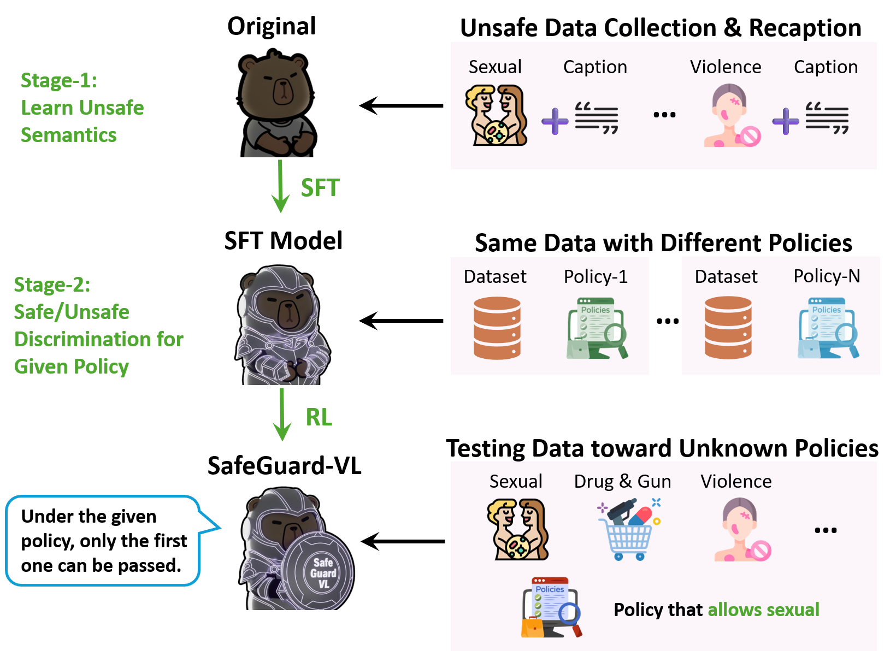

# SafeGuard-VL: Towards Policy-Adaptive Image Guardrail

<p align="center">
  <b>CVPR 2026</b>
</p>


<p align="center">
  <a href="https://arxiv.org/abs/2603.01228">Paper</a> |
  <a href="https://huggingface.co/tyodd/SafeGuard-VL-RL">Model</a> |
  <a href="https://huggingface.co/datasets/tyodd/SafeEditBench">Benchmark</a> |
  <a href="./README_zh.md">中文</a>
</p>


## Overview

SafeGuard-VL is a two-stage training framework for building **policy-adaptive visual safety guardrails**. Unlike prior guardrails that overfit to a single fixed safety policy, SafeGuard-VL generalizes across diverse and evolving safety policies.

- **Stage 1 (SFT):** Teaches the model to understand unsafe visual semantics via a novel self-recaptioning mechanism.
- **Stage 2 (RL):** Employs GRPO with verifiable rewards for policy-aware safe/unsafe discrimination.

We also introduce **SafeEditBench**, a cross-policy evaluation benchmark with semantically aligned safe-unsafe image pairs under five distinct safety policies (L1-L5).

<p align="center">
  
</p>


## Resources

| Resource               | Link                                                         | Description                                                  |
| ---------------------- | ------------------------------------------------------------ | ------------------------------------------------------------ |
| SafeGuard-VL-RL        | [HuggingFace](https://huggingface.co/tyodd/SafeGuard-VL-RL)  | Model weights (Qwen2.5-VL-7B-Instruct + Stage-2 RL)          |
| Qwen2.5-VL-7B-Instruct | [HuggingFace](https://huggingface.co/Qwen/Qwen2.5-VL-7B-Instruct) | Base model                                                   |
| SafeEditBench          | [HuggingFace](https://huggingface.co/datasets/tyodd/SafeEditBench) | Cross-policy evaluation benchmark with 5 policy levels       |
| UnsafeBench            | [HuggingFace](https://huggingface.co/datasets/yiting/UnsafeBench) | Safety benchmark across 9 harmful categories                 |
| LlavaGuard             | [HuggingFace](https://huggingface.co/datasets/AIML-TUDA/LlavaGuard) | Training data and benchmark; unsafe test images used for SafeEditBench construction |

## Installation

```bash
conda create -n safeguard python=3.10 -y
conda activate safeguard
pip install -r requirements.txt
```

## Quick Start

### Inference

```python
from transformers import Qwen2_5_VLForConditionalGeneration, AutoProcessor
from qwen_vl_utils import process_vision_info

model = Qwen2_5_VLForConditionalGeneration.from_pretrained(
    "tyodd/SafeGuard-VL-RL",
    torch_dtype="auto",
    device_map="auto",
)
processor = AutoProcessor.from_pretrained("tyodd/SafeGuard-VL-RL")

policy = "Your safety policy text here..."

messages = [
    {
        "role": "user",
        "content": [
            {"type": "image", "image": "path/to/image.jpg"},
            {"type": "text", "text": f"Based on the following policy, determine whether this image is safe or unsafe.\n\nPolicy: {policy}"},
        ],
    }
]

text = processor.apply_chat_template(messages, tokenize=False, add_generation_prompt=True)
image_inputs, video_inputs = process_vision_info(messages)
inputs = processor(
    text=[text],
    images=image_inputs,
    videos=video_inputs,
    padding=True,
    return_tensors="pt",
).to(model.device)

output_ids = model.generate(**inputs, max_new_tokens=512)
output = processor.batch_decode(
    output_ids[:, inputs.input_ids.shape[1]:], skip_special_tokens=True
)[0]
print(output)
```

### Evaluate on SafeEditBench

```bash
python eval/safeeditbench.py --model_path tyodd/SafeGuard-VL-RL --test_jsonl /path/to/test.jsonl --gpus 0,1,2,3
```

### Evaluate on UnsafeBench

```bash
# Inference + scoring
python eval/unsafebench.py --model_path tyodd/SafeGuard-VL-RL --test_jsonl /path/to/test.jsonl --gpus 0,1,2,3

# Scoring only (from existing predictions)
python eval/unsafebench.py --score_only --pred_file output/predictions.jsonl
```

### Generate Safe Counterparts (Image Editing)

Generate semantically aligned safe versions of unsafe images via a two-step pipeline:
(1) safety assessment model generates edit instructions, (2) image editing model applies minimal edits.

```bash
python data/safe_edit/safe_edit.py \
    --image_dir /path/to/unsafe_images \
    --output_dir /path/to/safe_images \
    --api_key YOUR_API_KEY \
    --base_url YOUR_BASE_URL
```

### Self-Recaptioning (Stage-1 Data Construction)

Generate recaptioned training data with enriched unsafe semantics.

```bash
python data/recaption/recaption.py \
    --input_jsonl /path/to/captions.jsonl \
    --output_jsonl /path/to/recaptioned.jsonl \
    --api_key YOUR_API_KEY \
    --base_url YOUR_BASE_URL \
    --model gemma-27b
```

### Training

Training is based on [ms-swift](https://github.com/modelscope/ms-swift) (tested with version from 2025.9.16).

```bash
# Stage-1: SFT
bash train/sft.sh

# Stage-2: GRPO (reward function in train/plugin.py)
bash train/grpo.sh
```

## Project Structure

```
SafeGuard-VL/
├── README.md
├── LICENSE
├── requirements.txt
├── .gitignore
├── assets/                  # Figures for README
│   └── pipeline.png
├── data/
│   ├── recaption/           # Self-recaptioning pipeline
│   │   └── recaption.py
│   └── safe_edit/           # Unsafe-to-safe image editing
│       └── safe_edit.py
├── train/
│   ├── sft.sh               # Stage-1: SFT training script
│   ├── grpo.sh              # Stage-2: GRPO training script
│   └── plugin.py            # GRPO reward function
└── eval/
    ├── safeeditbench.py     # SafeEditBench evaluation
    └── unsafebench.py       # UnsafeBench evaluation
```

## Citation

If you find this work useful, please cite:

```bibtex
@article{piao2026towards,
  title={Towards Policy-Adaptive Image Guardrail: Benchmark and Method},
  author={Piao, Caiyong and Yan, Zhiyuan and Xu, Haoming and Zhao, Yunzhen and Lin, Kaiqing and Xu, Feiyang and Zhou, Shuigeng},
  journal={arXiv preprint arXiv:2603.01228},
  year={2026}
}
```

## License

This project is released under the [Apache 2.0 License](LICENSE).

## Disclaimer

This repository contains research on safety guardrails for vision-language models. The datasets and models are intended for research purposes only. Some data may contain sensitive content for evaluation purposes.
